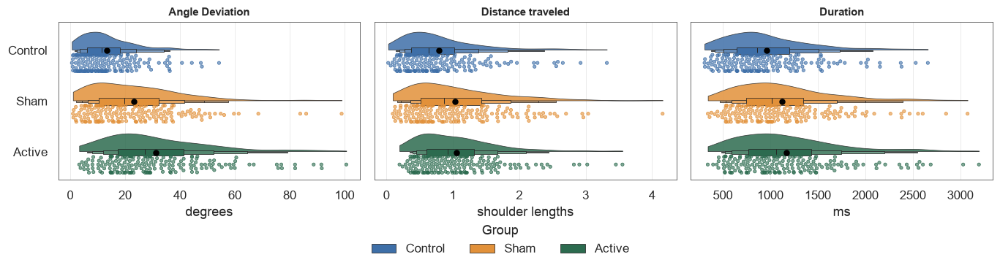

# fullplots

Raincloud plots for seaborn: a half violin, a letter-value box and a swarm of
the raw observations, stacked in one category slot. It is the layout you get in
R from `ggdist::stat_halfeye()` + `geom_boxplot()` + `geom_jitter()`, built here
out of `sns.violinplot` / `sns.boxenplot` / `sns.swarmplot` so it drops into an
existing matplotlib figure.



```python
from raincloud import raincloud, raincloud_grid, save_figure

raincloud(df, x="Angle Deviation", y="Group")               # one axes
raincloud_grid(df, ["Angle Deviation", "Duration"], "Group")  # one panel per measure
```

## What it does that seaborn does not

- **Half violins.** `violinplot(inner=None)` draws a symmetric body; the polygon
  vertices are folded onto one side afterwards. The fold follows the axis
  direction, because seaborn inverts the y axis for horizontal categoricals.
- **Layered offsets.** Each layer is translated along the category axis with an
  `Affine2D`. Swarms need the shift in the *offset transform*, not the offset
  data — seaborn recomputes the beeswarm layout on every draw and would
  overwrite a shift written into the offsets.
- **Swarm band width.** `swarmplot` hard-codes its width to 0.8 category slots
  and exposes no parameter, so a `Beeswarm` subclass is swapped in for the
  duration of the call.
- **Hue placement.** seaborn dodges each layer by *that layer's* `width`, which
  puts a 0.13-wide box and a 0.70-wide violin in different places. With `hue`
  the levels are positioned here instead, so the layers stay aligned.
- **Two-opacity dots.** `Collection.set_alpha` hits fill and stroke together;
  the fill (`point_alpha=0.6`) and stroke (`point_edge_alpha=1.0`) opacities are
  baked into the RGBA arrays separately, so overlapping dots still read as
  individual observations.

## Layout

One category slot is 1.0 wide. The three layers are placed inside it by
`violin_width` / `box_width` / `point_width` and the matching `*_offset`
arguments, all in those units, so keep the extents inside ±0.5.

```
+0.36 ─┐
       │   violin   width 0.70, base at +0.012
+0.055 ├─┐
       │ │ box      width 0.13  <- its top third sits inside the violin
-0.075 ├─┘
       │   points   width 0.32, centred at -0.25
-0.41 ─┘
```

The violin deliberately overlaps the box: `violin_offset = box_offset +
box_width / 6` puts the violin's base a third of the way down the box, and the
stacking order is pinned (violin 2.0, box 2.4, points 2.6) so the box always
reads on top. Change `box_width` and reapply that formula to keep the fit.

## Box style

The middle layer is a letter-value box by default, which keeps showing
structure out in the tail. `box_kind="box"` swaps in a plain Tukey boxplot:

```python
raincloud(df, x="Angle Deviation", y="Group", box_kind="box")          # whis=1.5
raincloud(df, x="Angle Deviation", y="Group", box_kind="boxen")        # k_depth="tukey"
```

`k_depth` applies to `"boxen"`, `whis` to `"box"`, and `showfliers` to both.
The box is opaque (`box_alpha=1.0`) so it stays legible where it overlaps the
violin; lower it if you want the density to show through.

## Colours

`PALETTE` is the default: steel blue `#3E6FA8`, amber `#E2913A`, deep green
`#2C6B4F` — separated by lightness (L\* ≈ 47 / 66 / 39) as well as hue, so they
hold up in greyscale and under deuteranopia. `PALETTE_MUTED` is the same three
lightened for fills; `REFERENCE_PALETTE` is the orange/teal/red of the figure
this was modelled on. Any seaborn palette name, list or `{level: colour}` dict
works too.

## Saving

```python
save_figure(fig, "figure1.svg")   # <text> nodes, editable in Illustrator/Inkscape
save_figure(fig, "figure1.pdf")   # font type 42, also editable
save_figure(fig, "figure1.png", dpi=600)
```

matplotlib outlines glyphs into paths by default, which makes SVG labels
uneditable. `save_figure` sets `svg.fonttype="none"` (and font type 42 for
PDF/EPS) inside an `rc_context`, so your global rcParams are untouched. The
machine opening the file then needs the font — stick to Arial or Helvetica if
it has to travel, or pass `editable_text=False` to outline the glyphs.

## Requires

Python ≥ 3.8, `seaborn >= 0.13` (the new categorical engine), matplotlib,
pandas, numpy.

```bash
pip install -r requirements.txt
python raincloud.py     # writes the demo figures
```
